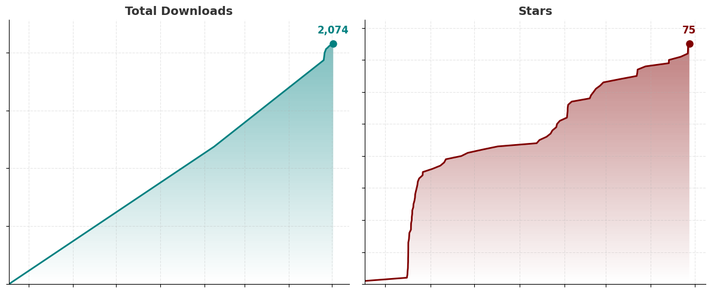

# HydroTracker

  

  <strong>A modern and private water intake tracking application</strong> 
  No Ads, No Subscription, No Internet

  <a href="#features">Features</a> •
  <a href="#screenshots">Screenshots</a> •
  <a href="#installation">Installation</a> •
  <a href="#technical-details">Technical Details</a> •
  <a href="#license">License</a>

  
  
  
  

  

---

## Features

### Core Functionality
- Daily Water Tracking
- Multiple Beverage Types
- Smart Goal Calculation
- Real-Time Progress Tracking
- Intelligent Reminders

### Analytics & History
- **Comprehensive Statistics:** Daily totals, averages, largest intakes, and time-based insights
- **Multiple View Modes:** Weekly bar charts, monthly heatmaps, and yearly activity calendars
- **Streak Tracking:** Monitor consecutive days of goal achievement
- **Success Metrics:** Track total liters consumed, success rate percentages, and goals met
- **Historical Navigation:** Browse past weeks, months, and years with interactive visualizations

### Health Connect Integration
- **Health Platform Sync:** Read and write hydration data to Android Health Connect.
- **Multi-App Support:** Import data from Samsung Health, Google Fit, Fitbit, Garmin, Strava, and other health apps (*As long as they use Health Connect API*)
- **External Entry Management:** Identify and manage entries from different sources. The app can **read** messy data from other apps that you have

### Home Screen Widgets
Available widgets:
- HydroProgress Widget (4x1)
- HydroCompact Widget (2x1)
- HydroLarge Widget (4x2)

All of them supports:
- Dynamic Theming
- Real-Time Updates

### Smart Notifications
- **Context-Aware Reminders:** Intelligent notifications that respect your sleep schedule
- **Adaptive Scheduling:** Automatic reminder intervals based on your wake/sleep times
- **Goal-Based Logic:** Stops reminders once daily goal is achieved
- **Boot Persistence:** Notifications automatically resume after device restart

### Personalization & Themes
- Material 3 Expressive Design
- Dark Mode Options
- Dynamic Colors
- And some extra stuff 😏

### Scientific Foundation
- **Evidence-Based Multipliers:** Hydration effectiveness based on peer-reviewed Beverage Hydration Index (BHI) research
- **International Standards:** Support for EFSA (European) and IOM (US) hydration guidelines
- **Activity-Based Adjustments:** Multipliers from 1.0x to 1.5x based on activity level
- **Beverage Science:** Accurate hydration calculations for different beverage types (Sports Drinks 1.1x, Milk 1.5x, ORS 1.5x, Juice 1.3x)

You can find all of the source inside the **settings page** of the app or from [here](app/src/main/assets/sources.md).

---

## Screenshots

  
  
  
  

### Themes & Notifications
| Light Mode | Dark Mode | Notification |
|-----------|----------------|--------------|
|  |  |  |

*Current visuals of the app might differ from these screenshots.*

---

## Installation

  
  

  <em>F-Droid release coming soon</em>

  Or download the APK directly from the releases page: 
  

---

## Support

### Get Help
- **Bug Reports & Feature Requests** - [GitHub Issues](https://github.com/Econ01/HydroTracker/issues)

  <h3>Support this Project</h3>
  
  &nbsp;
  

---

## Acknowledgments

### Research & Science
Beverage hydration effectiveness based on peer-reviewed research:
- "A randomized trial to assess the potential of different beverages to affect hydration status" (American Journal of Clinical Nutrition)
- Beverage Hydration Index (BHI) methodology
- EFSA (European Food Safety Authority) hydration guidelines
- IOM (Institute of Medicine) dietary reference intakes

  

## License

This project is licensed under the **GNU General Public License v3.0** - see the [LICENSE.md](app/src/main/assets/LICENSE.md) file for details.

### What this means:
- **Use:** Use this code for any purpose
- **Study:** Examine how it works
- **Share:** Distribute the app
- **Modify:** Make changes and improvements
- **Copyleft:** Derivative works **must** also be GPL v3.0

  <strong>HydroTracker - Stay hydrated, stay healthy!</strong> 
  <em>Developed by Ali Cem Çakmak</em>

